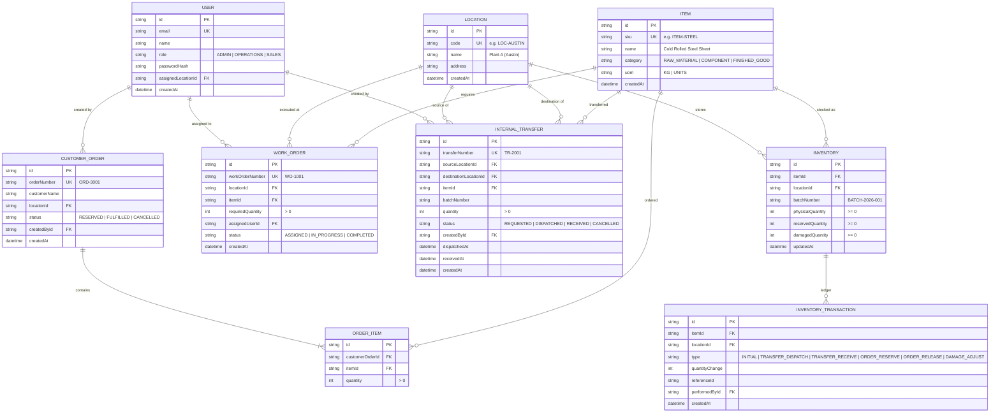

# Mini Operations ERP

> **Technical Case Study Submission**: A production-oriented, portable Full-Stack Operations ERP system built with **Node.js**, **TypeScript**, **Express.js**, **Prisma ORM**, **SQLite (WAL Mode)**, and **React 18 (Vite + Tailwind CSS)**.

---

## 📋 Business Scenario & Evaluated Flow

A company operates from multiple facilities and coordinates inventory, work orders, internal stock transfers, and customer orders:

$$\mathbf{Inventory} \longrightarrow \mathbf{Work\ Order} \longrightarrow \mathbf{Stock\ Check} \longrightarrow \mathbf{Internal\ Transfer\ /\ Shortage} \longrightarrow \mathbf{Customer\ Reservation}$$

### Key Capabilities & Business Logic
1. **Multi-Location Inventory**: Tracks Physical, Reserved, Damaged, and Available quantities per Location, Item, and Batch. Available stock is calculated strictly as:
   $$\text{Available} = \text{Physical} - \text{Reserved} - \text{Damaged}$$
2. **Work Order Material Shortage Check**: Admin can create Work Orders. The system checks available inventory at that location in real time and calculates shortage:
   $$\text{Shortage} = \max(0, \text{Required Quantity} - \text{Available At Location})$$
3. **Internal Stock Transfers**:
   - **On Dispatch**: Source physical inventory reduces immediately. Destination inventory does **NOT** increase.
   - **Before Receipt**: Destination inventory remains strictly unchanged.
   - **On Receipt**: Destination inventory increases. The system strictly **prevents receiving the same transfer twice**.
4. **Customer Orders & Concurrency Protection**:
   - Reserving stock increases `Reserved Quantity` while keeping `Physical Quantity` intact, reducing `Available Quantity`.
   - **Two users cannot reserve more stock than actually exists**: Enforced via atomic database transactions.
5. **Role-Based Access Control (RBAC)**:
   - **Admin**: Full access; can create Work Orders.
   - **Operations**: Manages inventory adjustments and internal transfers.
   - **Sales**: Creates customer orders and reserves stock.

---

## 🏗️ System Architecture & Database Schema (ER Diagram)



---

## 🔑 Pre-Seeded Test Credentials

| Role | Email | Password | Allowed Capabilities |
|---|---|---|---|
| **Admin** | `admin@erp.com` | `Admin@123` | Create Work Orders, view all, full administrative access |
| **Operations User** | `ops@erp.com` | `Ops@123` | Manage inventory adjustments, request, dispatch, and receive transfers |
| **Sales User** | `sales@erp.com` | `Sales@123` | Create customer orders, reserve stock, cancel & release reservations |

*Tip: The web UI includes an instant **1-Click Quick Demo Role Switcher** in the top navigation bar for seamless evaluation.*

---

## ⚙️ Tech Stack

- **Backend**: Node.js v20+ / v24, TypeScript, Express.js, Prisma ORM
- **Database**: SQLite (zero-config, portable relational database with ACID support). Can be pointed to PostgreSQL simply by changing `DATABASE_URL` in `.env`.
- **Frontend**: React 18, Vite, Tailwind CSS, Lucide Icons, React Router v6, Axios
- **API Documentation**: OpenAPI 3.0 / Swagger UI at `/api/docs`
- **Testing**: Vitest + Supertest

---

## 🚀 Quick Setup & How to Run

### Prerequisites
- Node.js (v18 or higher) and npm.

### 1. Installation & Database Setup
From the project root:
```bash
# Setup backend dependencies, run database migrations, and seed initial data
cd backend
npm install
npx prisma db push
npm run db:seed

# Setup frontend dependencies
cd ../frontend
npm install
```

### 2. Running the Application
Open two terminal windows:

**Terminal 1 (Backend API):**
```bash
cd backend
npm run dev
```
*Backend runs on `http://localhost:5000`*  
*Swagger Documentation: `http://localhost:5000/api/docs`*

**Terminal 2 (Frontend UI):**
```bash
cd frontend
npm run dev
```
*Frontend runs on `http://localhost:5173`*

*Alternatively, Windows users can simply double-click `start-all.bat` in the project root.*

---

## 🧪 How to Run Automated Tests

Run the mandatory automated test suite:
```bash
cd backend
npm test
```

### Test Suite Coverage (All 5 Mandatory Tests from Case Study):
1. **Test 1**: `Cannot reserve more than available inventory.`
   - Tests attempt to reserve stock beyond available quantity $\rightarrow$ verifies `409 Conflict` and inventory remains intact.
   - **Test 1b (Concurrency)**: Executes simultaneous competing orders (User A requests 80, User B requests 50 against an available stock of 100) $\rightarrow$ verifies exactly one succeeds and one is rejected, completely eliminating race conditions.
2. **Test 2**: `Cannot transfer more than available inventory.`
   - Tests transfer creation with quantity exceeding source stock $\rightarrow$ verifies `400 Bad Request`.
3. **Test 3**: `Destination stock increases only after transfer receipt.`
   - Verifies that on Dispatch: source inventory reduces while destination inventory does NOT change.
   - Verifies that on Receipt: destination inventory increases.
4. **Test 4**: `Same transfer cannot be received twice.`
   - Verifies that a second call to receive a transfer is blocked with `400 Bad Request: Same transfer cannot be received twice`.
5. **Test 5**: `Unauthorized user cannot perform restricted operation.`
   - Verifies Sales User cannot create Work Orders (`403 Forbidden`).
   - Verifies Operations User cannot create Customer Orders (`403 Forbidden`).
   - Verifies Sales User cannot dispatch transfers (`403 Forbidden`).
6. **Shortage Calculation Test**: Verifies Work Order shortage calculation: Required = 100, Available at Location = 60 $\rightarrow$ Shortage = 40.

---

## 📚 API Documentation (Swagger / OpenAPI)

Interactive Swagger UI is available at:
```
http://localhost:5000/api/docs
```
Allows testing all endpoints, request payloads, authentication tokens, and viewing data schemas.

---

## 🎥 Short Demo Video Walkthrough Script (5-7 Minutes)

When recording the submission demo video, follow this exact flow:

1. **Login & Role Overview (Minute 0:00 - 1:00)**:
   - Navigate to `http://localhost:5173`.
   - Use the **1-Click Demo Login** to sign in as **Admin**.
   - Show the navigation bar with active user role badge and instant role switcher.
2. **Inventory Module (Minute 1:00 - 2:00)**:
   - Navigate to **Inventory**.
   - Show multi-location breakdown: Plant A (Austin), Warehouse B (Dallas), Distribution C (Chicago).
   - Point out `Cold Rolled Steel Sheet` at Plant A: **Physical: 60, Reserved: 0, Available: 60**.
   - Point out `Precision Ball Bearing`: **Physical: 100, Reserved: 30, Available: 70**.
   - Demonstrate **"Adjust / Damage"** modal: adding 5 damaged units reduces Available to 65 automatically.
3. **Work Order & Automated Shortage (Minute 2:00 - 3:00)**:
   - Navigate to **Work Orders**.
   - Point out `WO-1001` for Steel at Plant A: Required = 100, Available = 60 $\rightarrow$ **Shortage: 40**.
   - Demonstrate the alternative location stock helper showing Warehouse B (Dallas) has 150 units available.
4. **Internal Stock Transfer Lifecycle (Minute 3:00 - 4:30)**:
   - Switch role to **Operations User** using the top-bar switcher.
   - Navigate to **Internal Transfers**.
   - Click **Request Transfer**: 40 units from Warehouse B (Dallas) to Plant A (Austin).
   - Click **Dispatch Stock**:
     - Switch to Inventory to prove Warehouse B stock dropped by 40, while Plant A stock has **NOT** increased yet.
   - Return to Transfers and click **Confirm Receipt**:
     - Switch to Inventory to prove Plant A stock is now 100.
     - Show that clicking receive again is locked/prevented.
5. **Customer Order & Concurrency Protection (Minute 4:30 - 6:00)**:
   - Switch role to **Sales User**.
   - Navigate to **Customer Orders**.
   - Create a customer order for 30 units: show Available drops from 70 to 40, Reserved increases to 60.
   - Click **"Simulate Concurrency Race"**:
     - Watch live test execute two simultaneous orders (e.g. 50 + 40 = 90 against 70 available).
     - Show the report card proving User A succeeded (201) and User B was rejected (409) with no double-spending.
   - Click **Cancel & Release** on an order to prove reserved stock is immediately returned to available.
6. **Automated Test Run (Minute 6:00 - 6:30)**:
   - Open terminal and run `npm test` in `backend` to show all 7 test suites passing green.

---

## 🛡️ Live Verification Preparedness

The codebase is pre-architected for unannounced live verification changes:
- **Change 1 (Damaged Quantity)**: `damagedQuantity` field already exists in schema and is factored into `Available = Physical - Reserved - Damaged`.
- **Change 2 (Partial Receipt)**: `receivedQuantity` field is already in the transfer model and service.
- **Change 3 (Order Cancellation)**: The `/api/orders/:id/cancel` endpoint and UI button are already implemented and tested.
- **Change 4 (Location Restriction)**: `assignedLocationId` is already tied to the User model and ready for middleware enforcement.
